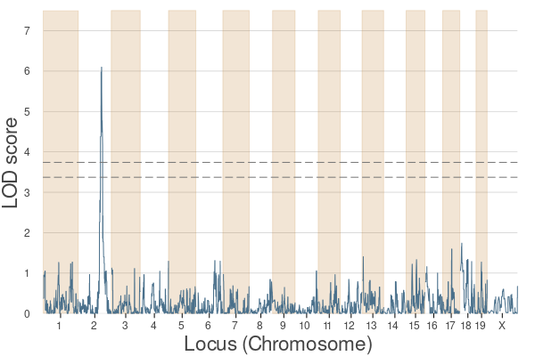

# BigRiverQTLPlots.jl

*Statistical plotting recipes for QTL analysis.*

[](https://github.com/senresearch/BigRiverQTLPlots.jl/actions/workflows/ci.yml)
[](https://codecov.io/gh/senresearch/BigRiverQTLPlots.jl)

`BigRiverQTLPlots.jl` is a versatile plotting package built in the Julia programming language. The package consists of specific plotting recipes, designed to streamline data visualization and enhance the process of statistical analysis in genetic studies. It's particularly suited for QTL (Quantitative Trait Loci) and eQTL (expression Quantitative Trait Loci) analyses, providing key features for clear and intuitive data representation.

## Features
Here are the main functions provided by BigRiverQTLPlots.jl:

- `plot_QTL()`: This function generates plots for LOD (logarithm of odds) scores with respect to marker positions. It's useful in viewing one genome scan result, or even multiple genome scan results, on a single plot. This helps to provide a broad overview of the QTL landscape.

- `plot_eQTL()`: This function is specifically designed to plot eQTL analysis results, assisting in visualization of genetic associations with gene expression levels.

## Installation
To install `BigRiverQTLPlots.jl`, you can use Julia's package manager. Here is the command:

```julia
using Pkg
Pkg.add("BigRiverQTLPlots")
```

## Usage
After installing `BigRiverQTLPlots.jl`, you can include it in your Julia script using the following command:

```julia
using BigRiverQTLPlots
```

From there, you can start using `plot_QTL` and `plot_eQTL` to plot your data. For example:

```julia
# Assuming `single_results_perms` are restulting lod scores
# gInfo contains genotype information  
plot_QTL(single_results_perms, gInfo)
```
```julia
# Assuming `lod_scores` are in multipletraits_results
# pInfo contains phenotype information
# gInfo contains genotype information  
# thresh is your LOD threshold value
plot_eQTL(multipletraits_results, pInfo, gInfo; threshold = 5.0)
```
## QTL Examples
```julia
using BigRiverQTLPlots, BulkLMM
using Plots

##############
# BXD spleen #
##############

########
# Data #
########
bulklmmdir = dirname(pathof(BulkLMM));

gmap_file = joinpath(bulklmmdir, "..", "data", "bxdData", "gmap.csv");
gInfo = BulkLMM.CSV.read(gmap_file, BulkLMM.DataFrames.DataFrame);

phenocovar_file = joinpath(bulklmmdir, "..", "data", "bxdData", "phenocovar.csv");
pInfo = BulkLMM.CSV.read(phenocovar_file, BulkLMM.DataFrames.DataFrame);

pheno_file = joinpath(bulklmmdir, "..", "data", "bxdData", "spleen-pheno-nomissing.csv");
pheno = BulkLMM.DelimitedFiles.readdlm(pheno_file, ',', header = false);
 # exclude the header, the first (transcript ID)and the last columns (sex)
pheno_processed = pheno[2:end, 2:(end-1)] .* 1.0;

geno_file = joinpath(bulklmmdir, "..", "data", "bxdData", "spleen-bxd-genoprob.csv")
geno = BulkLMM.DelimitedFiles.readdlm(geno_file, ',', header = false);
geno_processed = geno[2:end, 1:2:end] .* 1.0;

#################
# Preprocessing #
#################
traitID = 1112;
pheno_y = reshape(pheno_processed[:, traitID], :, 1);

###########
# Kinship #
###########
kinship = calcKinship(geno_processed);

########
# Scan #
########

single_results_perms = scan(
	pheno_y,
	geno_processed,
	kinship;
	permutation_test = true,
	nperms = 1000,
);

########
# Plot #
########
plot_QTL(single_results_perms, gInfo, significance = [0.10, 0.05])

# or by specifying the thresholds values

thrs = BigRiverQTLPlots.perms_thresholds(single_results_perms.L_perms, [0.10, 0.05]);

plot_QTL(single_results_perms.lod, gInfo, thresholds = thrs);
```



## eQTL Examples
```julia
using BigRiverQTLPlots, BulkLMM
using Plots

##############
# BXD spleen #
##############

########
# Data #
########
bulklmmdir = dirname(pathof(BulkLMM));

gmap_file = joinpath(bulklmmdir, "..", "data", "bxdData", "gmap.csv");
gInfo = BulkLMM.CSV.read(gmap_file, BulkLMM.DataFrames.DataFrame);

phenocovar_file = joinpath(bulklmmdir, "..", "data", "bxdData", "phenocovar.csv");
pInfo = BulkLMM.CSV.read(phenocovar_file, BulkLMM.DataFrames.DataFrame);

pheno_file = joinpath(bulklmmdir, "..", "data", "bxdData", "spleen-pheno-nomissing.csv");
pheno = BulkLMM.DelimitedFiles.readdlm(pheno_file, ',', header = false);

geno_file = joinpath(bulklmmdir, "..", "data", "bxdData", "spleen-bxd-genoprob.csv")
geno = BulkLMM.DelimitedFiles.readdlm(geno_file, ',', header = false);
geno_processed = geno[2:end, 1:2:end] .* 1.0;

###########
# Kinship #
###########
kinship = calcKinship(geno_processed);

########
# Scan #
########

multipletraits_results, heritability_results = bulkscan_null(
	pheno_processed,
	geno_processed,
	kinship,
)

########
# Plot #
########
plot_eQTL(multipletraits_results, pInfo, gInfo; threshold = 5.0);
```


## Contribution
Contributions to BigRiverQTLPlots.jl are welcome and appreciated. If you'd like to contribute, please fork the repository and make changes as you'd like. If you have any questions or issues, feel free to open an issue on the repository.

## License
`BigRiverQTLPlots.jl` is licensed under the [GNU AFFERO GENERAL PUBLIC LICENSE](LICENSE). For more information, please refer to the LICENSE file in the repository.

## Support
If you have any problems or questions using `BigRiverQTLPlots.jl`, please open an issue on the GitHub repository. We'll be happy to help!